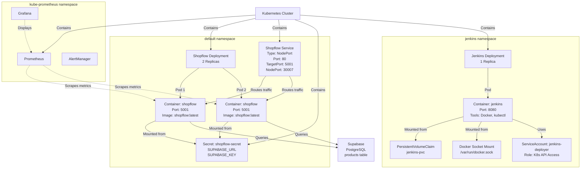
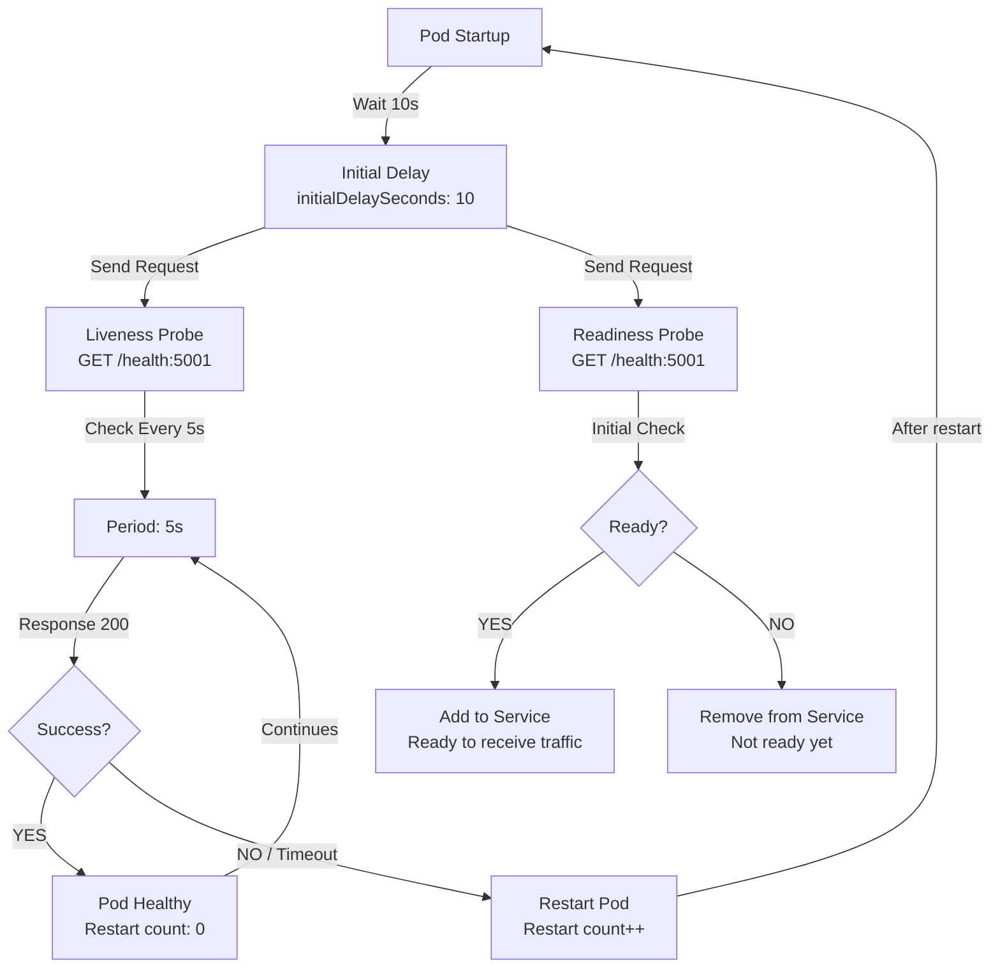
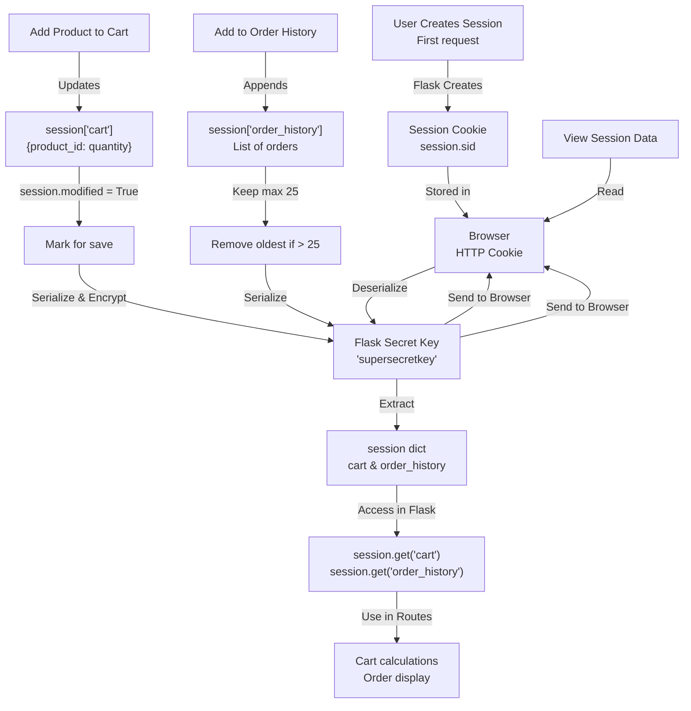
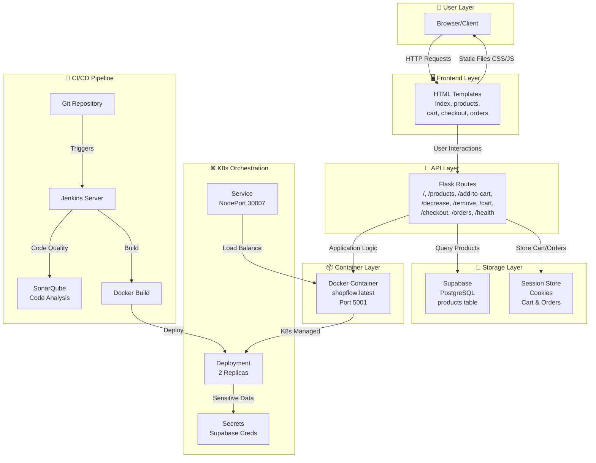

# Shopflow-Lite - Flow Diagrams

## 1. API Request/Response Flow

```mermaid
graph TD
    A[User Browser] -->|GET /| B[Flask Home Route]
    A -->|GET /products| C[Flask Products Route]
    C -->|Query| D[Supabase API]
    D -->|Return products| C
    C -->|Render| E[products.html]
    E -->|Display| A
    
    A -->|GET /add-to-cart/id| F[Add to Cart Route]
    F -->|session['cart'] update| G[Flask Session]
    G -->|Redirect| A
    
    A -->|GET /cart| H[View Cart Route]
    H -->|_cart_line_items| I[Calculate Total]
    I -->|Return items, total| H
    H -->|Render| J[cart.html]
    J -->|Display| A
    
    A -->|GET /checkout| K[Checkout Route]
    K -->|Create Order| L[Order Object]
    L -->|Store in session| G
    L -->|Render| M[checkout.html]
    M -->|Display| A
    
    A -->|GET /orders| N[Order History Route]
    N -->|Fetch from session| G
    N -->|Render| O[orders.html]
    O -->|Display| A
    
    A -->|GET /health| P[Health Check]
    P -->|Return JSON| Q[status: running]
    Q -->|Display| A
```

## 2. CI/CD Pipeline Flow

```mermaid
graph LR
    A[Git Repository] -->|Webhook Trigger| B[Jenkins Pipeline Start]
    
    B -->|Stage 1| C["Clone Check<br/>ls"]
    C -->|Success| D[Stage 2]
    
    D -->|"Stage 2: SonarQube<br/>Code Analysis"| E{Analysis<br/>Complete?}
    E -->|Pass| F[Stage 3]
    E -->|Fail| Z["❌ Pipeline Fails<br/>Notify Developer"]
    
    F -->|"Stage 3: Docker Check<br/>docker --version"| G[Stage 4]
    
    G -->|"Stage 4: Build Docker Image<br/>docker build -t shopflow-test ."| H["Docker Image<br/>shopflow-test"]
    
    H -->|Stage 5| I["Apply K8s Manifests<br/>kubectl apply"]
    I -->|deployment.yaml| J["Create/Update<br/>Deployment<br/>2 Replicas"]
    I -->|service.yaml| K["Create/Update<br/>Service<br/>NodePort: 30007"]
    
    J -->|Pull Image| L["Kubernetes Cluster"]
    K -->|Configure Networking| L
    
    L -->|Ready| M["✅ Deployment<br/>Complete"]
```



## 3. Kubernetes Deployment Architecture



## 4. Data Flow - Shopping Cart Operations

```mermaid
graph TD
    A["User Visit<br/>localhost:30007"]
    
    A -->|GET /products| B["Fetch Products from Supabase"]
    B -->|SELECT * FROM products| C["Supabase API"]
    C -->|Return product data| B
    B -->|Render HTML| D["products.html<br/>Display products"]
    D -->|Display| A
    
    A -->|Click 'Add to Cart'| E["GET /add-to-cart/123"]
    E -->|session['cart']['123'] += 1| F["Update Session"]
    F -->|Store in Cookie| G["Browser Cookie"]
    E -->|Redirect| H["GET /cart"]
    
    H -->|Get session cart| I["Loop through cart items"]
    I -->|For each product_id| J["Query Supabase"]
    J -->|Get product details| K["Calculate quantity & subtotal"]
    K -->|Sum all| L["Calculate total"]
    L -->|Render| M["cart.html<br/>Display cart items"]
    M -->|Display| A
    
    A -->|Click 'Checkout'| N["GET /checkout"]
    N -->|Create order object| O["order = {<br/>id: uuid,<br/>placed_at: timestamp,<br/>items: [...],<br/>total: amount<br/>}"]
    O -->|Append to order_history| P["session['order_history']"]
    P -->|Keep last 25| Q["Clear old orders"]
    Q -->|Clear cart| R["session.pop('cart')"]
    R -->|Render| S["checkout.html<br/>Order confirmed"]
    S -->|Display| A
    
    A -->|View History| T["GET /orders"]
    T -->|Fetch session order_history| U["Render orders.html"]
    U -->|Display| A
```

## 5. Deployment Pipeline End-to-End

```mermaid
graph LR
    A["Developer Commits<br/>Code to Git"]
    A -->|Triggers| B["Jenkins Webhook"]
    
    B -->|Starts| C["Pipeline Job"]
    
    C -->|Stage 1| D["Clone Check<br/>Verify repo"]
    D -->|Stage 2| E["SonarQube Analysis<br/>Code Quality Check"]
    E -->|Stage 3| F["Docker Verify<br/>Check Docker CLI"]
    F -->|Stage 4| G["Docker Build<br/>Build image:<br/>shopflow-test"]
    
    G -->|Builds| H["Docker Image<br/>python:3.9-slim<br/>+ Flask deps<br/>+ app code"]
    
    H -->|Stage 5| I["K8s Deployment<br/>kubectl apply"]
    
    I -->|Applies| J["deployment.yaml"]
    I -->|Applies| K["service.yaml"]
    
    J -->|Creates| L["2 Pod Replicas<br/>Running Flask app"]
    K -->|Exposes| M["NodePort: 30007<br/>Port: 80 → 5001"]
    
    L -->|Pulls secrets| N["shopflow-secret<br/>Env vars injected"]
    
    L -->|Startup| O["Health Check<br/>GET /health"]
    O -->|Returns| P["{status: running}"]
    
    P -->|Ready| Q["✅ Live on<br/>http://localhost:30007"]
```



## 6. Liveness & Readiness Probe Flow



## 7. Session Management Flow



## 8. Complete System Integration Map



